# GitHub Manager

A portable desktop client for GitHub, built with **Python + PySide6**. One `.exe`
that does the work the website makes you do by hand — and an AI assistant that
will only ever talk about GitHub.

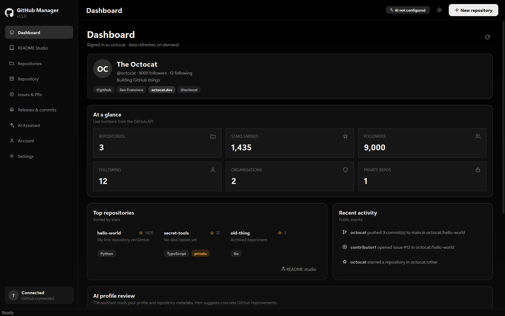

<p align="center">
  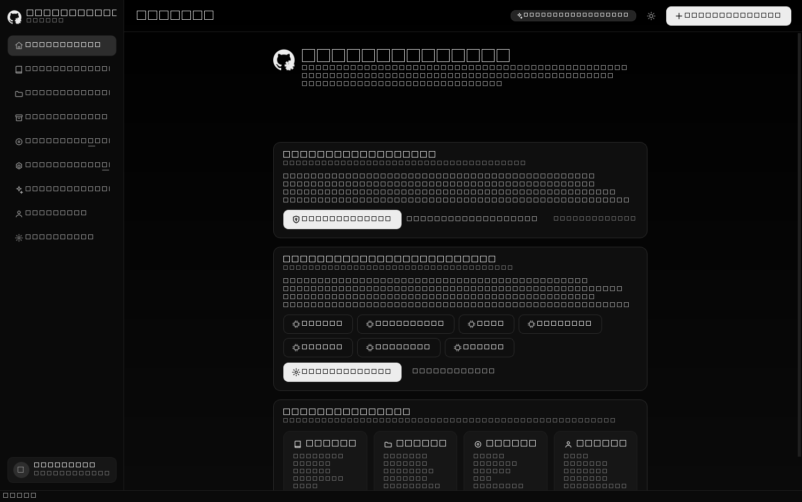
  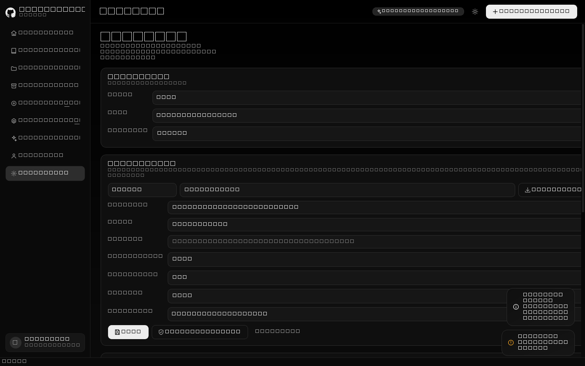
</p>

<p align="center">
  <a href="https://github.com/mrlurix/github-manager/releases/latest">
    
  </a>
  
  
  
</p>

---

## Download

**[GitHubManager.exe](https://github.com/mrlurix/github-manager/releases/latest)** —
one file, about 63 MB.

No installer, no Python, no admin rights. Copy it anywhere and run it; a `data\`
folder appears beside it holding your token and settings. Put it on a USB stick
and it carries your setup with it.

The binary is deliberately not in the repository — a 63 MB file in every clone
and every fork is a cost paid by everyone forever for the convenience of the one
person who built it. Releases keep that clean.

---

## What it does

### README Studio

Reads the live repository — file tree, languages, dependency files, the existing
README — and writes a complete one from it. Pick a tone, a language, an audience
and the sections you want; watch the preview update as you type; then commit the
result straight to `README.md` on whichever branch you are on.

<p align="center">
  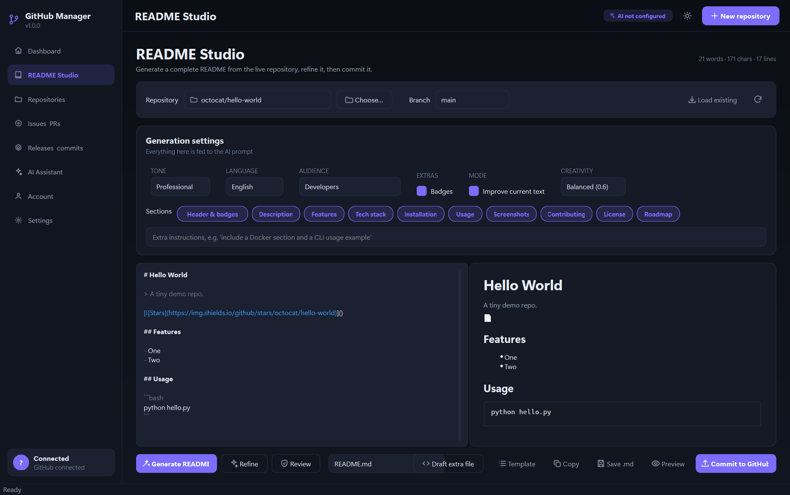
</p>

Also drafts `CONTRIBUTING.md`, `LICENSE`, `.gitignore`, `CODEOWNERS`,
`SECURITY.md`, `CHANGELOG.md`, Actions workflows, Dependabot config, issue and PR
templates, and `.editorconfig`.

### Repository

Files, branches, tags, collaborators and webhooks for one repository, in one
place. Browse and filter the tree, preview any file, upload and delete, create a
branch from the current one, add or remove collaborators with their permissions.

<p align="center">
  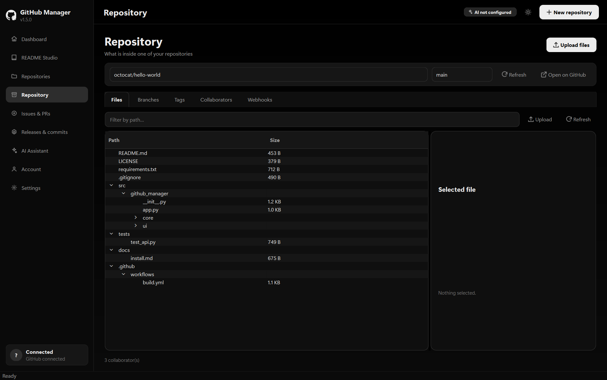
</p>

### Repositories, Issues & PRs, Releases & commits

Create, rename, archive, fork, change visibility and delete repositories. Read
issues and pull requests with their comments, close and reopen, draft an issue
from a one-line idea, triage a backlog into a table, and write the reply.
Turn a commit list into release notes, publish a release, and get a Conventional
Commit message out of a plain-language description.

<p align="center">
  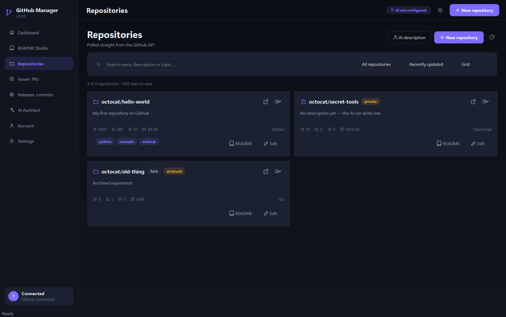
  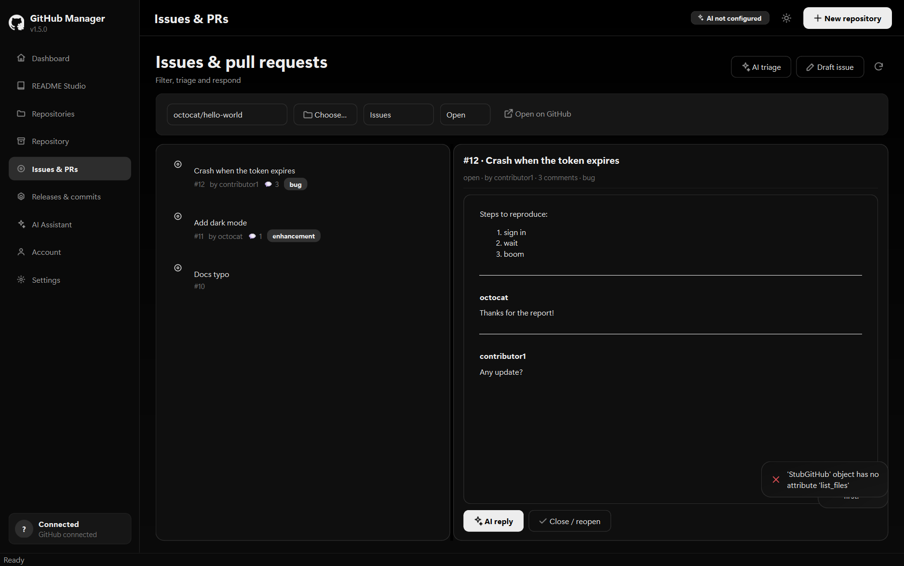
</p>

<p align="center">
  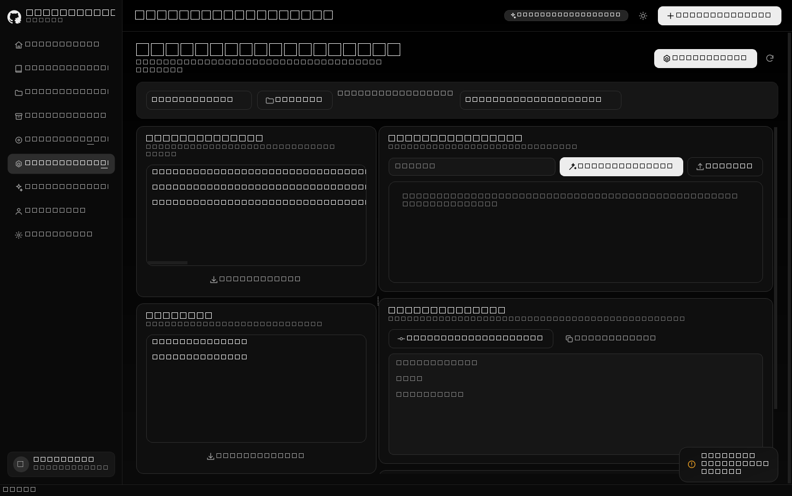
  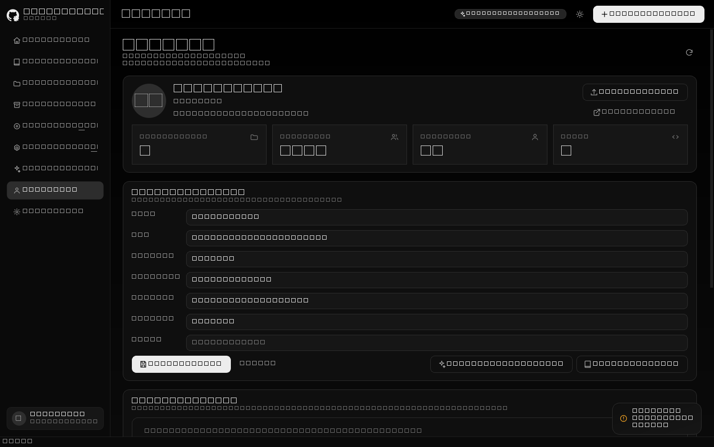
</p>

### AI Assistant

A chat scoped to GitHub, optionally grounded in the selected repository's actual
contents. The Dashboard's profile review reads your public presence and suggests
concrete improvements.

<p align="center">
  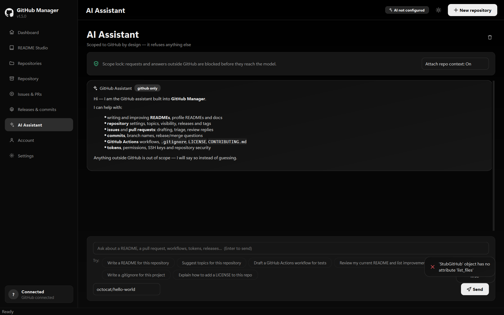
</p>

---

## The GitHub-only scope lock

The assistant is not merely *prompted* to stay on topic. Three independent layers
enforce it, so a clever instruction cannot get past:

1. **Before the request leaves** — `app/core/ai_guard.py` classifies the input
   against a GitHub vocabulary and a list of strong off-topic signals. Cooking,
   weather, medical, legal, horoscope and small talk are refused *before any
   network call is made*.

2. **In the prompt** — every request carries an explicit allow list (READMEs,
   repositories, issues, PRs, git, Actions, releases, profiles, tokens) and an
   explicit deny list.

3. **On the way back** — the answer is checked again before it is displayed. If
   it has drifted off topic, or it is a bare refusal, it is discarded and
   replaced with the scope notice.

The assistant also cannot run commands, write files on its own, or reach any
service other than the GitHub API and whichever AI provider you configured.

---

## Running it from source

You need **Python 3.10+** on Windows.

```bat
run.bat
```

The script makes a `.venv`, installs `requirements.txt`, and starts the app. By
hand:

```bat
python -m venv .venv
.venv\Scripts\pip install -r requirements.txt
.venv\Scripts\python main.py
```

Linux and macOS work for development, though the build targets Windows:

```bash
python3 -m venv .venv && .venv/bin/pip install -r requirements.txt
.venv/bin/python main.py
```

### First run

1. **Settings → GitHub** — paste a
   [personal access token](https://github.com/settings/tokens). Fine-grained
   tokens work. Recommended scopes: `repo`, `read:org`, `workflow`, `user`, plus
   `delete_repo` only if you want the destructive delete action.
2. **Settings → AI** — pick a provider and paste a key, or point it at a local
   model. Any OpenAI-compatible endpoint works.
3. Open **README Studio**, choose a repository, press **Generate**.

---

## The AI provider

Anything that speaks `POST {base_url}/chat/completions` works — OpenAI,
OpenRouter, Groq, Together, Ollama, LM Studio, or a gateway of your own.

**List models** pulls the provider's catalogue into the picker. **Test
connection** sends a one-word probe and tells you which model answered.

A fully offline setup needs no key at all:

```bash
ollama pull llama3.1
```

Then choose Ollama, pick `llama3.1`, and save.

Tunable: temperature, max tokens, request timeout, and whether answers stream in
token by token.

---

## Keyboard

| | |
| --- | --- |
| `Ctrl+1` … `Ctrl+9` | Jump to a page |
| `Ctrl+K` | AI Assistant |
| `Ctrl+,` | Settings |
| `Ctrl+R` | Refresh the current page |
| `Ctrl+N` | New repository |
| `Ctrl+B` | Toggle the sidebar |
| `Ctrl+Shift+R` | Toggle dark / light |
| `Ctrl+Q` | Quit |

---

## Both themes

<p align="center">
  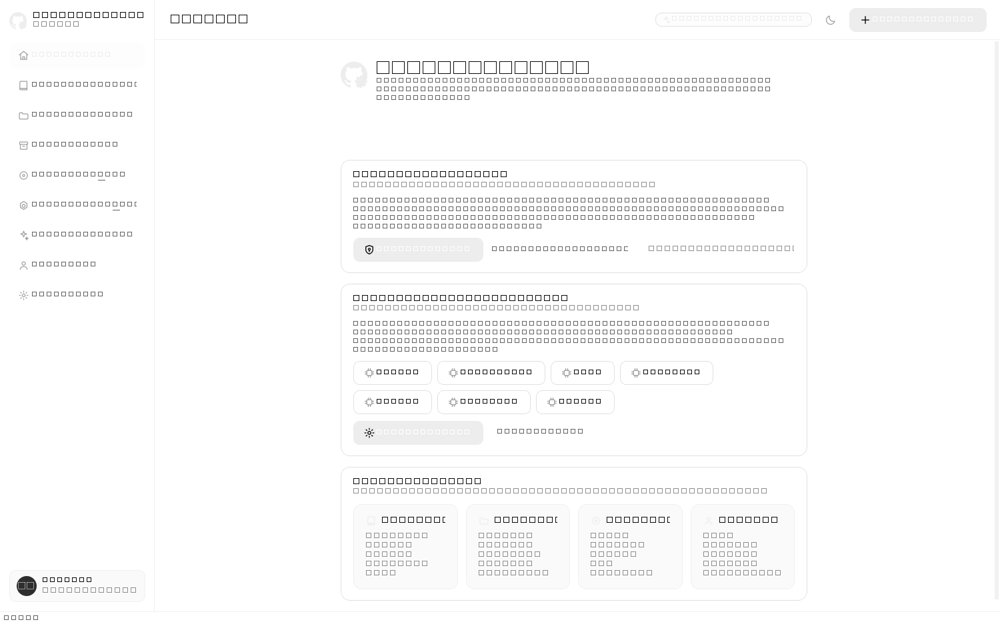
  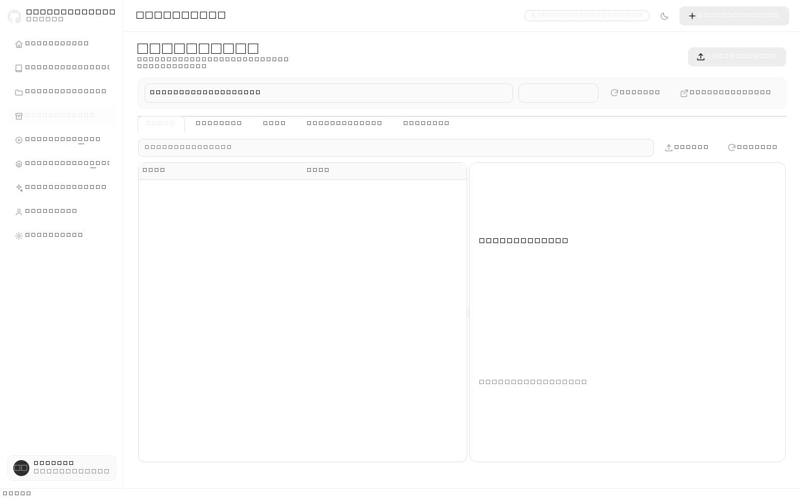
</p>

Monochrome on purpose. Colour in the interface is now only ever used to carry
meaning — success, warning, danger — so a red error and a grey one are never the
same sentence. Everything else is black, white, and the greys between.

<p align="center">
  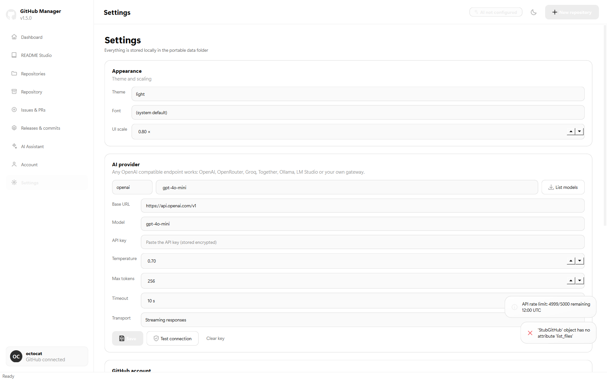
</p>

The desktop app and the [documentation site](https://mrlurix.github.io/github-manager/)
share one design system and one logo, generated from a single script so they
cannot drift apart.

---

## Where your data lives

Everything sits in `data\` **next to the executable**:

```
data/
  settings.json    theme, font, UI scale, AI model, ...
  secrets.json     token and API key, encrypted
```

The token and the key are encrypted with **Windows DPAPI**
(`CryptProtectData`), which ties them to your Windows account — another user on
the same machine cannot decrypt them. They are never written in plain text, and
never leave the machine except in HTTPS requests to `api.github.com` and to the
AI provider you chose.

Set `GHM_PORTABLE=0` to use `%APPDATA%\GitHubManager` instead. If the executable
folder is read-only — a network share, say — the app falls back there on its own.

---

## Security

- AI output and fetched markdown are treated as untrusted text. The preview goes
  through an allow-list HTML sanitiser; image sources are restricted to
  `http(s)`; links are limited to `http(s)` and `mailto` *and* re-checked on
  click; `url(...)` and `@import` are stripped from inline CSS.
- Token-shaped text is scrubbed from every error message and toast, so a provider
  echoing your key back at you does not put it on screen.
- `GitHubClient` refuses any absolute URL that is not `api.github.com` or
  `uploads.github.com`, so the token cannot be sent to a third-party host by a
  crafted response.
- Repository, path and branch inputs are validated against GitHub's own rules
  before a request is built, which closes `owner/../../user` style traversal.
- Deleting a repository requires typing its full name.
- Every destructive action confirms exactly what will happen. The AI never writes
  to GitHub without one.

---

## Building the exe

```bat
build.bat
```

```bash
python build.py --clean
```

Renders the icon, generates the PyInstaller spec, and produces a single
self-contained `dist\GitHubManager.exe`. To rebuild just the icon:

```bash
python build.py --icon-only
```

The script checks its own output — a onefile build that produced a folder layout,
or an implausibly small exe, is reported as a failure, because the broken binary
would otherwise fail at launch with no build-time clue.

---

## Tests

```bat
python tests\run_all_tests.py
```

Eleven suites, over a thousand checks, no network access required. Both the
GitHub API and the AI provider are stubbed, so nothing touches your account.

`tests\mock_github_server.py` is a real HTTP server that speaks the GitHub REST
API: it paginates with a genuine `Link: rel="next"`, returns base64 content,
enforces authentication, and answers with real 401 / 403 / 404 / 422 / 500
bodies. The integration suite points `GitHubClient` straight at it, which is how
it catches the things a stub never can — a client that quietly stops at page one,
or that shows a blank box instead of a rate-limit message.

The documentation site is checked in a real browser:

```bash
npm install --no-save puppeteer
node tools/verify_layout.js          # 222 checks
node tools/verify_hover.js           #  35 checks
node tools/verify_site_security.js   # 128 checks
node tools/verify_search.js          #  43 checks
node tools/verify_motion.js          #  84 checks
node tools/verify_nav.js             #  64 checks
```

---

## Project layout

```
main.py                     entry point, high-DPI setup, app icon, taskbar identity
build.py                    PyInstaller build
run.bat / build.bat
requirements.txt
app/
  config.py                 portable paths, settings, DPAPI secrets
  core/
    github_api.py           GitHub REST client
    ai_api.py               OpenAI-compatible chat client, with streaming
    ai_guard.py             the GitHub-only scope lock
    ai_tasks.py             every AI feature, as a plain function
    secure.py               DPAPI-backed secret storage
    redact.py               token-shaped text scrubbing
  ui/
    theme.py                palettes, typography, the global stylesheet
    widgets.py              cards, badges, toasts, icons, the logo
    main_window.py          sidebar navigation and the page stack
    pages/                  welcome, dashboard, readme, repositories,
                            repo_admin, issues, releases, assistant,
                            account, settings
tests/                      eleven suites + a mock GitHub server
docs_src/                   documentation site source
tools/                      build_docs, make_logo, screenshot, verify_*
```

`app/core/` imports no Qt at all. That is what lets the GitHub and AI logic be
tested on its own, without a display.

---

## Documentation

**<https://mrlurix.github.io/github-manager/>**

An English site with full-text search that folds case, accents and typographic
punctuation, and handles the Arabic text where the docs mention a Persian README.
Generated from `docs_src/` by a Python script and served as plain files — no Node,
no build service. Its fonts are self-hosted, so the Content-Security-Policy keeps
`font-src 'self'` and there is no third party in the critical path.

---

## Licence

MIT — see [LICENSE](LICENSE).

Not affiliated with, endorsed by, or supported by GitHub, Inc. The Octocat mark is
GitHub's; this is an independent client that uses the public API.
