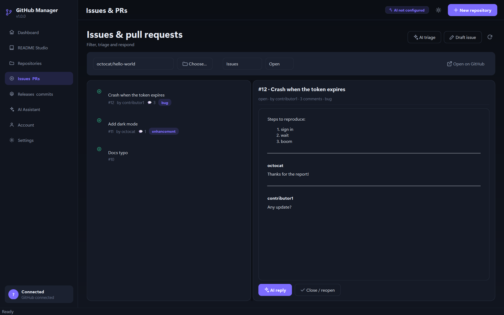
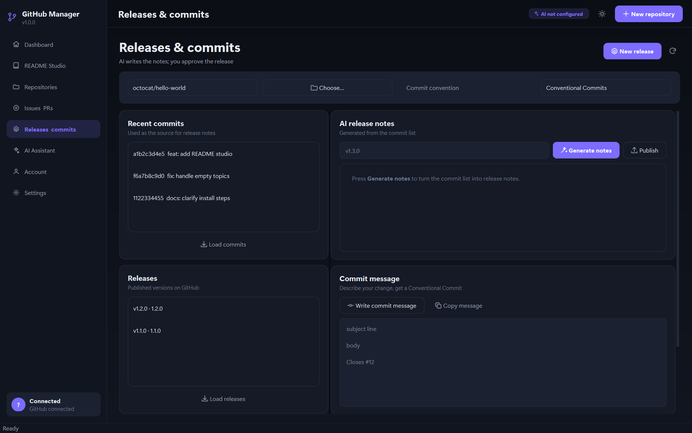
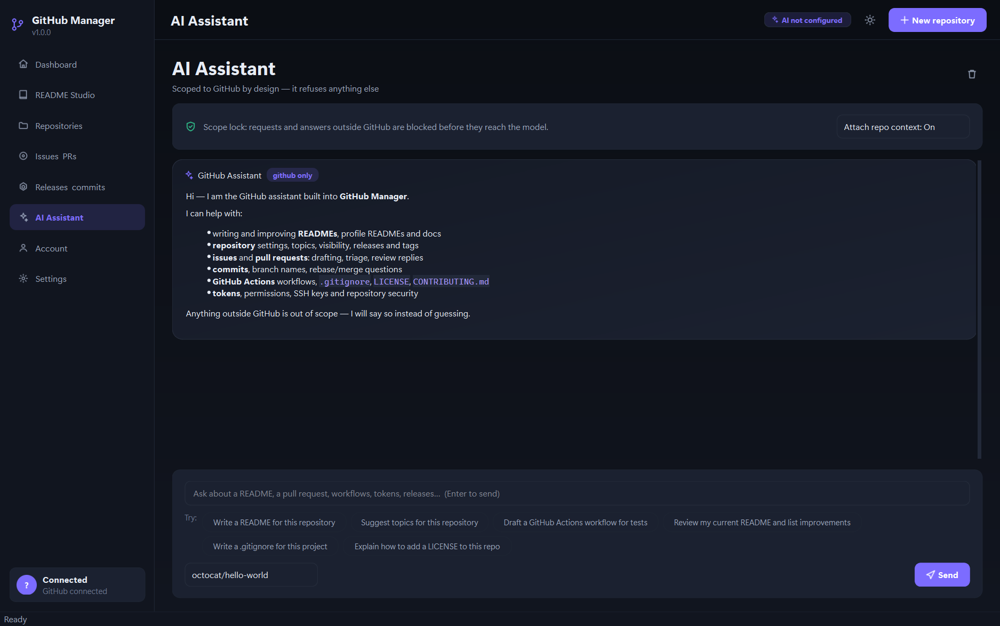
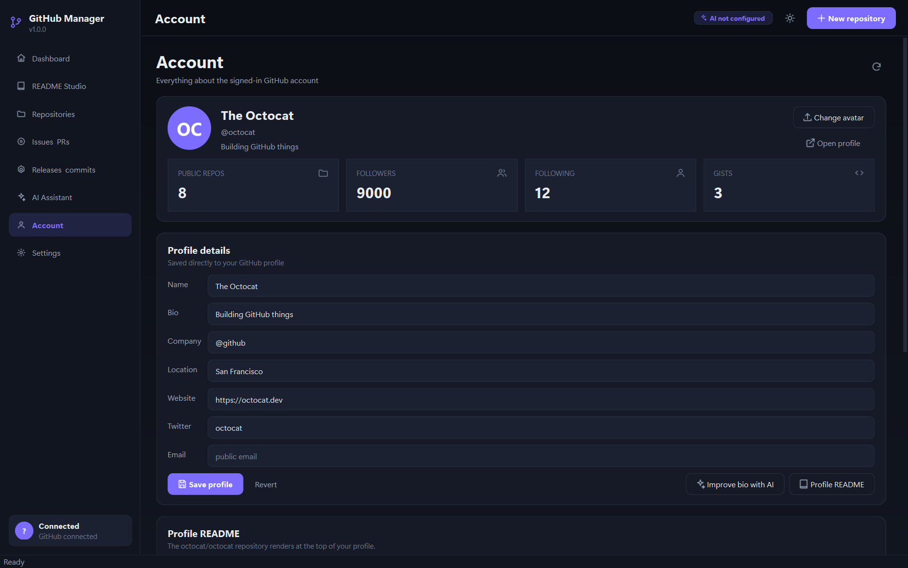
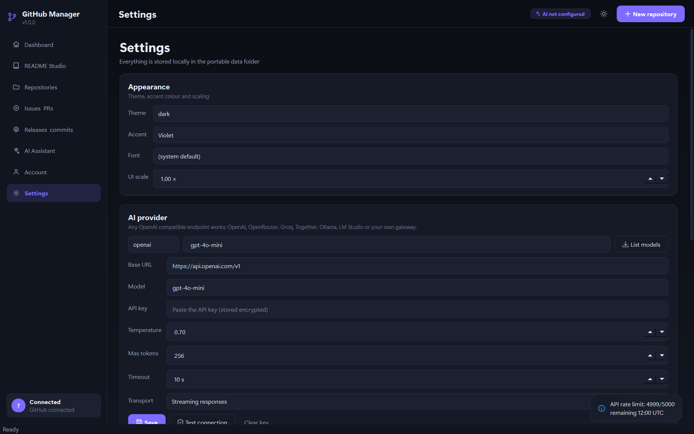
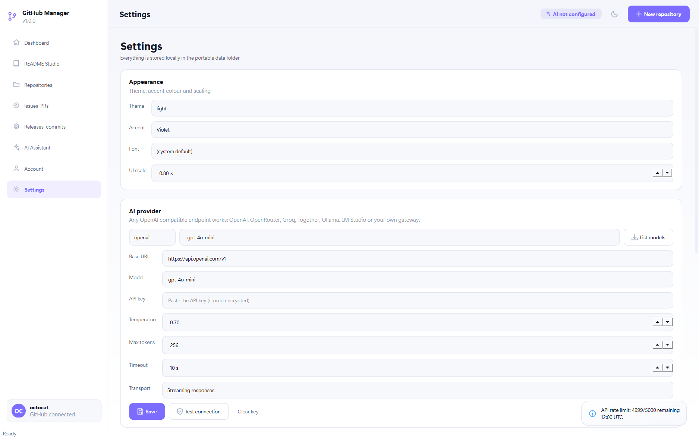

# GitHub Manager

A portable, AI assisted desktop client for GitHub. Built with **Python + PySide6**,
it writes READMEs, manages repositories, handles issues and pull requests, and
ships as a single `.exe` that runs on any Windows machine without Python.

The assistant is **locked to GitHub**: it refuses anything outside the domain
before the request ever reaches the model.


---

## Download

Grab the portable build from the
[latest release](https://github.com/mrlurix/github-manager/releases/latest):

**`GitHubManager.exe`** — one file, about 63 MB. It runs on any 64-bit Windows
machine with no Python, no installer and no admin rights. Copy it anywhere, and
a `data\` folder appears beside it for your token and settings.

The executable is deliberately *not* committed to the repository: a binary that
size permanently bloats every clone and fork. Releases keep the history clean
and give each version its own download.

---

## Contents

- [Download](#download)
- [Highlights](#highlights)
- [The GitHub-only scope lock](#the-github-only-scope-lock)
- [Screens](#screens)
- [Getting started](#getting-started)
- [Configuring the AI](#configuring-the-ai)
- [Building the portable exe](#building-the-portable-exe)
- [Where data is stored](#where-data-is-stored)
- [Project layout](#project-layout)
- [Tests](#tests)
- [Keyboard shortcuts](#keyboard-shortcuts)
- [Security notes](#security-notes)

---

## Highlights

| Feature | What it does |
| --- | --- |
| **README Studio** | Reads the live repository (tree, languages, dependency files, existing README) and writes a complete README. Live preview, one-click refine, and a commit straight to `README.md` on any branch. |
| **Extra file drafting** | `CONTRIBUTING.md`, `LICENSE`, `.gitignore`, `CODEOWNERS`, `SECURITY.md`, `CHANGELOG.md`, GitHub Actions workflows, Dependabot, issue and PR templates, `.editorconfig`. |
| **Repository admin** | Create, rename, edit, archive, fork, change visibility, manage topics, delete (with a typed confirmation). Grid/compact views, search, sort, visibility filters. |
| **Issues & PRs** | Browse issues and pull requests, read comments, close/reopen, draft an issue from a one-line idea, triage the whole backlog into a typed table, and write maintainer replies. |
| **Releases & commits** | Turn a commit list into release notes, publish a GitHub release, write a Conventional Commit from a plain-language description, and create branches. |
| **Account** | Profile fields, avatar upload, profile README (the `user/user` repository) drafted and committed for you, organisation list, rate limit status. |
| **AI Assistant** | A chat scoped to GitHub that can be grounded in the selected repository's real contents. |
| **Dashboard** | Profile snapshot, live metrics, recent public activity, and an AI review of your whole GitHub presence. |

Modern flat UI with a dark and a light theme, six accent colours, adjustable font
and UI scale, HiDPI support, and a matching native title bar.

---

## The GitHub-only scope lock

You asked that the AI do GitHub work and nothing else. That is enforced in three
independent places, so a clever prompt cannot get past it:

1. **Input classification** (`app/core/ai_guard.py`)
   A request is checked against a GitHub vocabulary and a short list of strong
   off-topic signals. Cooking, weather, medical, legal, horoscope and small-talk
   requests are rejected *before* any network call is made.

2. **System prompt**
   Every request carries a system prompt with an explicit allow list (READMEs,
   repositories, issues, PRs, git, Actions, releases, profiles, tokens) and an
   explicit deny list, plus a short refusal style so the answer stays useful.

3. **Output validation**
   Answers are checked again before display. If they drift off-topic, or are a
   bare refusal, they are discarded and replaced with the scope notice.

The assistant also has no ability to run commands, write files on its own, or
reach any service other than the GitHub API and the AI provider you configured.

---

## Screens

| | |
| --- | --- |
|  |  |
| **README Studio** — generate, refine and commit | **Repositories** — create, tune and organise |
|  |  |
| **Issues & PRs** — triage and reply | **Releases & commits** — notes and messages |
|  |  |
| **AI Assistant** — scoped to GitHub | **Account** — profile and organisations |
|  |  |
| **Settings** — dark theme | **Settings** — light theme |

---

## Getting started

### Run from source

```bat
run.bat
```

The script creates `.venv`, installs `requirements.txt` and starts the app. On
Linux/macOS:

```bash
python -m venv .venv && .venv/bin/pip install -r requirements.txt
.venv/bin/python main.py
```

### First launch

1. **Connect GitHub** — paste a personal access token from
   [github.com/settings/tokens](https://github.com/settings/tokens).
   Recommended scopes: `repo`, `read:org`, `workflow`, `user`, plus
   `delete_repo` if you want the destructive repository-delete action. Fine
   grained tokens work too; the app only needs repository, issue, PR and
   profile permissions.
2. **Choose an AI provider** — pick a preset or paste your own OpenAI compatible
   endpoint and key.
3. Open **README Studio**, pick a repository and press **Generate README**.

---

## Configuring the AI

Any endpoint that speaks `POST {base_url}/chat/completions` works. Presets in
**Settings → AI provider**:

| Preset | Base URL | Needs a key |
| --- | --- | --- |
| OpenAI | `https://api.openai.com/v1` | yes |
| OpenRouter | `https://openrouter.ai/api/v1` | yes |
| Groq | `https://api.groq.com/openai/v1` | yes |
| Together | `https://api.together.xyz/v1` | yes |
| Ollama | `http://localhost:11434/v1` | no |
| LM Studio | `http://localhost:1234/v1` | no |
| Custom | anything else | depends |

**List models** pulls the provider's model catalogue into the picker.
**Test connection** sends a one-word probe and reports the model that answered.

Ollama gives a fully offline setup:

```bash
ollama pull llama3.1
```

Then choose `Ollama` in Settings, pick `llama3.1`, and save. No API key required.

Other options you can tune: temperature, max tokens, request timeout and whether
responses stream in token by token.

---

## Building the portable exe

```bat
build.bat
```

or

```bash
python build.py --clean
```

The build renders an icon, generates the PyInstaller spec, and produces a single
self-contained `dist/GitHubManager.exe`. Copy that one file to any Windows
machine — no Python, no installer, no admin rights.

The script verifies its own output: a onefile build that accidentally produced
a folder layout (or an implausibly small exe) is reported as a build failure,
because the broken exe would otherwise fail at launch with
`Failed to load Python DLL` and no build-time clue.

`python build.py --onedir` produces a folder build instead, which starts faster.

Optional: install [UPX](https://github.com/upx/upx) to shrink the executable
further; it is detected automatically.

---

## Where data is stored

Everything lives in a `data/` folder **next to the executable**, so the app is
truly portable — put it on a USB stick and carry your settings with you.

```
data/
  settings.json    preferences: theme, accent, AI model, ...
  secrets.json     token and API key, encrypted
```

The token and API key are encrypted with **Windows DPAPI** (`CryptProtectData`),
which ties them to the current Windows user account. They are never written in
plain text and never leave the machine except in HTTPS requests to
`api.github.com` and to the AI provider you configured.

Set `GHM_PORTABLE=0` to store data under `%APPDATA%\GitHubManager` instead.
If the executable folder is read-only (for example on a network share), the app
falls back to that location automatically.

---

## Project layout

```
github_manager/
  main.py                     entry point, high-DPI setup, app icon
  build.py                    PyInstaller build script
  requirements.txt
  run.bat / build.bat
  app/
    config.py                 portable paths + settings dataclass
    core/
      github_api.py           GitHub REST client (accounts, repos, issues, …)
      ai_api.py               OpenAI compatible chat client with streaming
      ai_guard.py             the GitHub-only scope lock
      ai_tasks.py             every AI feature, as a function
      secure.py               DPAPI-backed secret storage
      redact.py               token-shaped text scrubbing for errors and toasts
    ui/
      theme.py                palettes, typography, the global QSS
      widgets.py              cards, badges, toasts, flow layout, icons
      markdown.py             markdown rendering + code highlighting
      sanitize.py             allow-list HTML sanitiser for the preview
      editor.py               split markdown editor with live preview
      workers.py              thread-pool tasks with streaming support
      dialogs.py              reusable modal dialogs
      context.py              shared services handed to every page
      main_window.py          sidebar navigation and page stack
      pages/                  welcome, dashboard, readme, repositories,
                              issues, releases, assistant, account, settings
  tests/                      eight suites, no network access required
  tools/                      screenshot and crop helpers
```

`app/core/` has no Qt imports at all, which keeps the GitHub and AI logic
testable on its own.

---

## Tests

```bash
python tests/run_all_tests.py
```

| Suite | Covers |
| --- | --- |
| `ai_guard_test.py` | Scope classification, answer validation, prompt contents, markdown rendering |
| `ai_tasks_test.py` | Every AI task function, JSON parsing, config and secret round-trips, API error messages |
| `security_test.py` | Token redaction, host allow-listing, repo/path/branch validation, HTML sanitising, prompt-injection resistance |
| `integration_test.py` | The real client over real HTTP against `mock_github_server.py`: pagination, status codes, base64 content, validation errors, rate limits, plus the whole UI driven against it |
| `smoke_test.py` | Every page builds and renders against a stubbed GitHub API, including failure paths |
| `feature_test.py` | End-to-end flows driven through the real widgets: create / edit / delete a repository, commit a README, reply to and draft issues, publish a release, edit the profile, upload an avatar, change every setting |
| `ai_flow_test.py` | Streaming generation, refinement, commit path, and the scope lock blocking off-topic input |
| `layout_test.py` | Every page at 1080×680 through 1920×1080 — catches collapsed rows and clipped controls |

The suites stub both the GitHub API and the AI provider, so they run offline and
never touch your account.

### The mock GitHub server

`tests/mock_github_server.py` is a real HTTP server that speaks the GitHub REST
API: it paginates with a genuine `Link: rel="next"` header, returns base64 file
content, enforces authentication, and answers with real 401 / 403 / 404 / 422 /
500 bodies. It is what the integration suite points `GitHubClient` at, which is
why that suite catches things a stub never can — a client that quietly stops at
page one, or that shows a blank error box for a rate limit.

That is also why `GitHubClient` takes an `api_url`. The code path exercised
against the mock is the same one used against github.com, and it makes GitHub
Enterprise support a small change if you want it later.

To capture the screenshots in this README:

```bash
set QT_QPA_PLATFORM=windows
python tools/screenshot.py screenshots
```

---

## Keyboard shortcuts

| Shortcut | Action |
| --- | --- |
| `Ctrl+1` … `Ctrl+7` | Jump to a page |
| `Ctrl+K` | AI Assistant |
| `Ctrl+,` | Settings |
| `Ctrl+R` | Refresh the current page |
| `Ctrl+N` | New repository |
| `Ctrl+B` | Toggle the sidebar |
| `Ctrl+Shift+R` | Toggle dark / light theme |
| `Ctrl+Q` | Quit |

---

## Security notes

- The token is stored encrypted with Windows DPAPI and bound to your Windows
  account; another user on the same machine cannot decrypt it.
- Repository deletion requires typing the full repository name, and the token
  only needs the `delete_repo` scope if you actually use it — omit that scope and
  the app works for everything else.
- Every destructive action (delete repository, close issue, publish release,
  commit a file) shows a confirmation dialog with exactly what will happen. The
  AI never writes to GitHub without one.
- AI output is treated as untrusted text: it is rendered as markdown, never
  executed, and never used as a shell command.

### Hardening applied to untrusted input

AI output, a fetched README and an issue body are all attacker-influenced text
that ends up in a `QTextBrowser` — a real HTML engine that fetches images and
follows links. These are handled explicitly:

| Risk | Mitigation |
| --- | --- |
| Raw HTML smuggling scripts, iframes or event handlers into the preview | `app/ui/sanitize.py` re-parses the rendered HTML against an allow-list of tags and attributes; anything unknown is dropped |
| `file://` and `data:` image sources reading local content | Image `src` is limited to `http(s)`; everything else is discarded |
| `javascript:` / `file:` links firing when clicked | Links are limited to `http(s)` and `mailto`, *and* every click is re-checked in `SafeLinksMixin` before the browser is launched |
| CSS fetching a remote URL (`url(...)`, `@import`) | Those declarations are stripped from `style` attributes |
| Provider error bodies echoing the API key back into the UI | `app/core/redact.py` scrubs token-shaped text from every error, toast and message box |
| Path traversal in a typed repository name (`owner/../../user`) | `validate_repo`, `validate_repo_path` and `validate_branch_name` reject anything not matching GitHub's own rules, before any request is built |
| The token being sent to a third-party host | `GitHubClient._build_url` refuses any absolute URL outside `api.github.com` / `uploads.github.com` |
| Command injection through a file path | The "open folder" helper uses an argument list, never a shell string |
| Secrets readable by other accounts | The secrets file is written `0600` on POSIX; on Windows it is DPAPI-encrypted |
| Avatar uploads | Type and 1 MB size are checked locally first, avoiding GitHub's confusing 422 |

Remote `http(s)` images *are* rendered, so badges work. That is a deliberate
trade — GitHub renders them too (through its camo proxy) — and the residual
exposure is limited to "a third party sees which repository page was opened".

---

## Licence

MIT — see [LICENSE](LICENSE).
